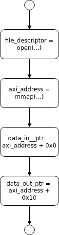
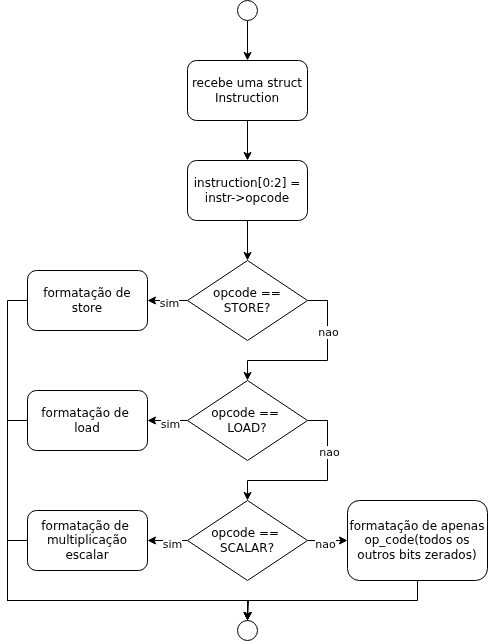
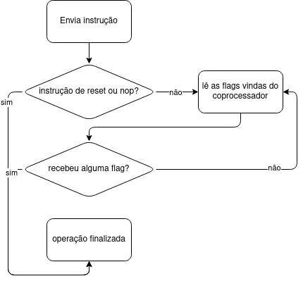
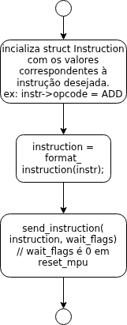

# Matrix Unit Processor Library 📚

## Sobre o Projeto 🌟
Esta biblioteca, desenvolvida em *assembly* ARMv7, foi criada para facilitar a comunicação entre o *Hard Processor System* (HPS) e o coprocessador projetado no primeiro problema do PBL de Sistemas Digitais.  
No caso deste projeto, foi utilizado o coprocessador desenvolvido pelo monitor Maike: 🔗 https://github.com/DestinyWolf/CoProcessador_PBL2_SD_2025-1

## Autor ✍️
Davi Macêdo Gomes

## Ferramentas Utilizadas 🛠️
1. **Quartus Prime**  
2. **VSCode e Neovim**  
3. **GCC**  
4. **GNU Make**

## Sumário 📑
- [Conexão entre FPGA e HPS](#conexão-entre-fpga-e-hps)  
- [basic.h](#basich)  
  - [init_mpu](#init_mpu)  
  - [finish_mpu](#finish_mpu)  
  - [format_instruction](#format_instruction)  
  - [send_instruction](#send_instruction)  
  - [Operações](#operações)  
- [Testes](#testes)  
- [Observações](#observações)  

---

## Conexão entre FPGA e HPS 🔌
A comunicação entre a FPGA e o HPS no kit é estabelecida por meio de uma ponte AXI (*AXI Bridge*), utilizando PIOs (*Parallel In/Out*) para representar as entradas e saídas do coprocessador. Os PIOs implementados são:

- **PIO_DATA_IN** 📥:  
  - **Tamanho**: 19 bits  
  - **Descrição**: Representa a instrução de 18 bits e um bit adicional para o sinal de *write enable* da memória.  
  - **Observação**: Apesar do nome sugerir entrada, é um PIO de saída, pois transmite dados da HPS para a FPGA.

- **PIO_DATA_OUT** 📤:  
  - **Tamanho**: 11 bits  
  - **Descrição**: Corresponde à saída do coprocessador (8 bits) e às flags *done*, *overflow* e *wrong address*.

---

## basic.h 🗂️
O acesso aos PIOs via memória é implementado em *assembly* ARMv7, com as seguintes funções:

### init_mpu 🚀
- **Descrição**: Realiza a chamada de sistema `open("/dev/mem", ...)` para obter o *file descriptor* da memória do sistema. Em seguida, utiliza `mmap(..., file_descriptor)` para mapear o endereço base do barramento AXI (`axi_address`). Por fim, inicializa os ponteiros `data_in_ptr` e `data_out_ptr`.  

 📊

### finish_mpu 🛑
- **Descrição**: Encerra as variáveis inicializadas em `mpu_init`, executando `close(file_descriptor)` e `munmap(axi_address)`, além de definir `data_in_ptr` e `data_out_ptr` como `NULL`.  

 📊

### format_instruction 📝
- **Descrição**: Recebe uma `struct Instruction` e formata cada campo como um inteiro de 32 bits. Utiliza o `op_code` como condição para personalizar a formatação, adaptando-se aos quatro tipos de organização de dados da ISA.  

 📊

### send_instruction 📬
- **Descrição**: Recebe dois parâmetros: `instruction` (int) e `wait_flags` (int). Envia a instrução para `pio_data_in` por meio de `data_in_ptr`. Se `wait_flags` for diferente de zero (ou seja, não for uma operação NOP ou RST), inicia um loop até que o coprocessador retorne uma flag, lida via `data_out_ptr`.  

 📊

### Operações (nop, load, store, add, sub, mul, mul scalar, reset) ⚙️
- **Descrição**: Todas as operações compartilham o mesmo algoritmo, diferindo apenas na formatação da `struct Instruction` local.  

 📊

---

## Testes 🧪
Os testes foram conduzidos com matrizes 5x5, seguindo os padrões abaixo:  
- Operações entre matriz identidade e matrizes arbitrárias. ✅  
- Operações entre matriz nula e matrizes arbitrárias. ✅  
- Operações entre matriz unitária e matrizes arbitrárias. ✅  
- Operações entre matrizes arbitrárias. ✅  
- Operações com elementos que ultrapassam os limites de um inteiro de 8 bits (x > 127 ou x < -128). ⚠️  

---

## Observações 📌
- Não há tratamento de erros para chamadas de função ou exceções do coprocessador (como *overflow* e *wrong address*), o que pode levar a comportamentos inesperados. 🚨  
- Um aprimoramento futuro seria o suporte a matrizes maiores que 5x5 sem alterações no coprocessador. 🔮  
- As variáveis `data_out` do coprocessador e das flags são globais. 🌍  